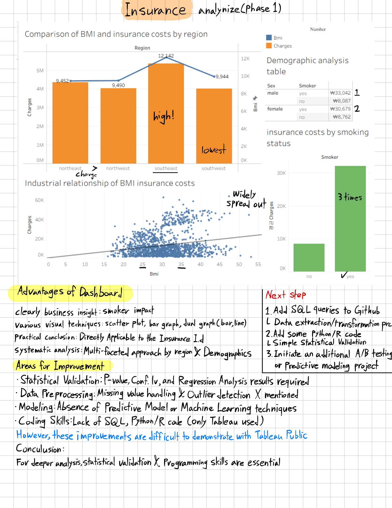

# Limitations and Insights from BI Tool Analysis

## Project Approach
- **Initial Approach**: Visualization-focused analysis using only Tableau from a BI perspective
- **Goal**: Deriving business insights without coding

## Insights from the Analysis Process
While reviewing the analysis results and organizing feedback, I realized that **BI tools alone have limitations**.

### Discovered Limitations:
- **Statistical Validation**: P-values, confidence intervals, regression analysis are needed but difficult to achieve with Tableau
- **Data Preprocessing**: Lack of systematic preprocessing such as missing value handling and outlier detection
- **Predictive Modeling**: Unable to apply machine learning or predictive modeling techniques
- **Advanced Coding**: Limited complex data transformation without SQL, Python/R

## Conclusion
While BI tools are an excellent starting point, I learned that **statistical validation and programming skills are essential for more in-depth analysis**.

